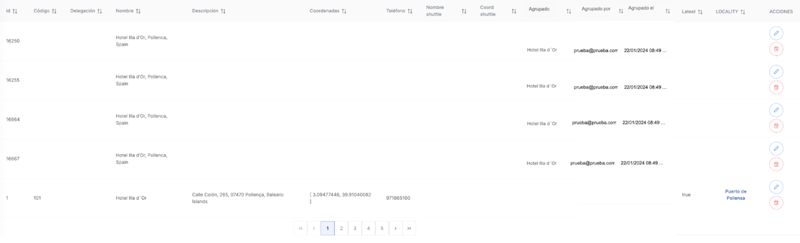
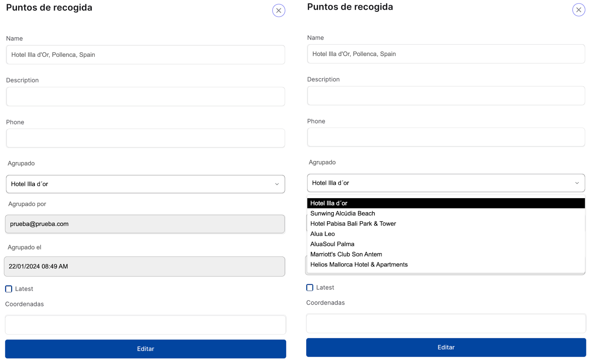
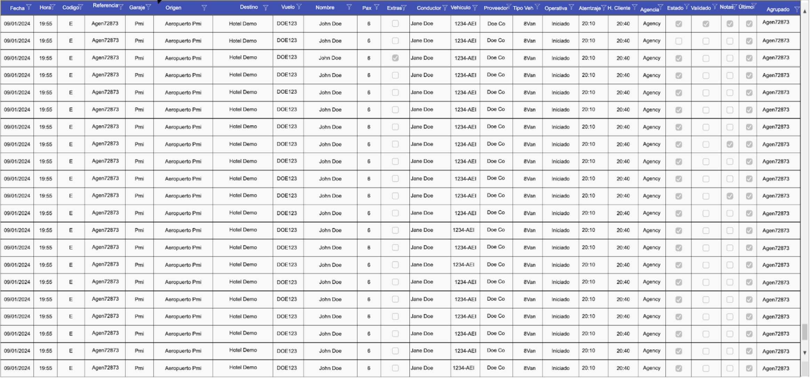
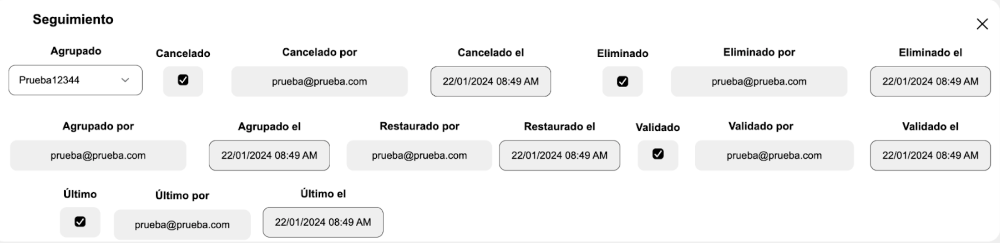

S13.2 When a user is listing the existing locations.pickup_points grid; Then the "grouping_token" (“Agrupado” in the UI), per W13.2.1, should be the name of some other record in the same pickup_points table; grouping_token, grouped_by (‘agrupado por’ in the UI) should show who did the grouping and grouped_at (‘agrupado el’ in the UI) should show when the grouping was done;per W13.2.2, should be a dropdown where the user can search for existing pickup_points records by the “name” column; grouped_by (‘agrupado por’ in the UI) should show who did the grouping and grouped_at (‘agrupado el’ in the UI) should show when the grouping was done; Because Operators in need to group multiple pickup_points (via grouping_token ) should not use a random string but an existing pickup_point name and they need to know who and when the records were grouped.

W13.2.1 

W13.2.2

S13.3 When a user is listing the existing bookings.transfer_services grid; Then "grouping_token" (“Agrupado” in the UI) per W13.3.1 should be the bookings.transfer_services.service_number of some other record in the same bookings.transfer_services; grouping_token per W13.3.2 should be a dropdown where the user can search for existing bookings.transfer_services records by the “service_number” column (“referencia” in the UI); grouped_by (‘agrupado por’ in the UI) field should show who did the grouping; grouped_at (‘agrupado el’ in the UI) should show when when the grouping was done; Because Operators in need to group multiple transfer_services (via grouping_token ) should not use a random string but an existing transfer_services.service_number and they need to know who and when the records were grouped.

W13.3.1 

W13.3.2

